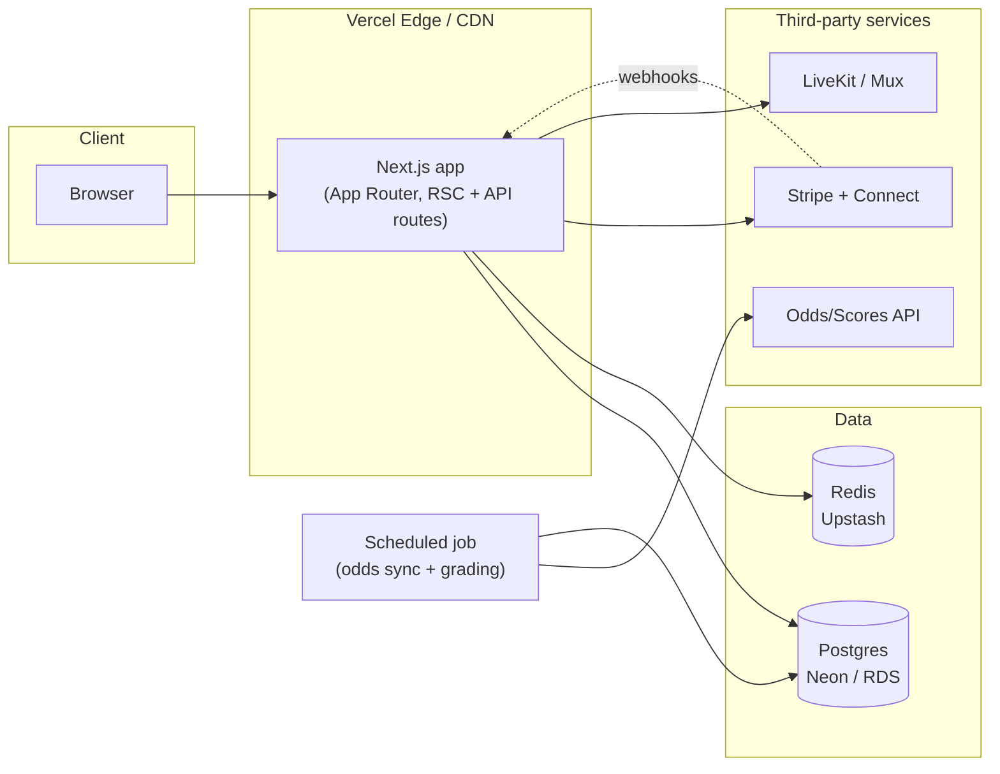

# OwnerFlow Sports — Architecture & Production Roadmap

This document describes what is built in this repository today, and exactly what
changes to make it production-ready: real payments, real odds data, real video
streaming, and infrastructure that scales past a single SQLite file.

## 1. What's implemented right now

A fully working Next.js 16 (App Router) application with a real relational
database, real authentication, and real server-side business logic — no mocked
UI states, no placeholder buttons. Specifically:

- **Auth**: NextAuth v5, credentials provider, bcrypt password hashing, JWT
  sessions, role-based access (`BETTOR`, `HANDICAPPER`, `ADMIN`).
- **Data model**: Prisma schema (`prisma/schema.prisma`) covering users,
  handicapper profiles, membership tiers, subscriptions, games, picks, parlays
  (with legs), purchases, follows, live feed posts/likes/comments, live
  streams/chat, and a wallet ledger. SQLite in dev, swaps to Postgres by
  changing one datasource line (see §3).
- **Marketplace economics**: every pick/parlay purchase and every subscription
  runs through a real `$transaction` — debits the buyer's wallet, credits the
  handicapper's earnings (80/20 split, see `PLATFORM_TAKE_RATE` in
  `src/app/api/purchases/route.ts` and `src/app/api/subscriptions/route.ts`),
  and writes an auditable `WalletTransaction` row. This is the same shape
  Stripe Connect destination charges will drop into (§4.1).
- **Handicapper Studio** (`/studio`): create picks, build multi-leg parlays,
  create membership tiers, schedule and go live on streams — all real writes
  against the database, gated to the authenticated handicapper's own profile.
- **Live feed**: real posts, likes, and comments (`/feed`), polling-based.
- **Live streaming**: real DB-backed live/scheduled/ended state, a
  broadcaster-side camera preview (via `getUserMedia`, local only), and a
  polling-based live chat. **Multi-viewer video distribution is not wired up**
  — see §4.3 for the exact integration point.
- **Demo wallet**: every account gets demo credit and can "deposit" more
  instantly from `/account/wallet`. This exists so every purchase/subscribe
  button is fully functional without requiring payment provider API keys in
  this environment. §4.1 replaces it with real money.

## 2. Tech stack

| Layer | Choice | Why |
|---|---|---|
| Framework | Next.js 16 (App Router, Turbopack, React 19) | Server components keep data-fetching close to the DB; API routes double as the backend. |
| Styling | Tailwind CSS v4 + hand-rolled Radix primitives | Full control over the luxury visual language without shipping a generic component-library look. |
| ORM | Prisma 6 | Type-safe schema, migrations, works identically against SQLite (dev) and Postgres (prod). |
| Auth | NextAuth v5 (Credentials + JWT) | Drop-in room to add OAuth providers later without touching the data model. |
| Validation | Zod | Every API route validates its body before touching the DB. |

## 3. Moving from SQLite to Postgres

1. Provision a Postgres instance (Neon, RDS, Supabase, or Vercel Postgres).
2. In `prisma/schema.prisma`, change:
   ```prisma
   datasource db {
     provider = "postgresql"
     url      = env("DATABASE_URL")
   }
   ```
3. Set `DATABASE_URL` to the Postgres connection string.
4. `npx prisma migrate deploy` to apply the existing migration history.
5. Two SQLite-specific things to double check after the switch: `String`
   columns used for pipe/comma-separated lists (`HandicapperProfile.specialties`,
   `MembershipTier.perks`) should become Postgres native arrays
   (`String[]`) — trivial migration, cosmetic only, everything still works if
   left as-is. Case-insensitive search in `/search` currently relies on
   SQLite's default case-insensitive `LIKE`; on Postgres add
   `mode: "insensitive"` to the `contains` filters in
   `src/app/search/page.tsx`.
6. Add PgBouncer (or your host's pooler) in front of Postgres once you're
   running serverless functions — Prisma's connection count adds up fast
   under concurrent invocations.

## 4. Integration points for production

Each of these is a real feature in the app today, running against demo/local
implementations. The replacement is additive — swap the implementation behind
the same UI and API surface, nothing in the frontend needs to change.

### 4.1 Payments — Stripe

Replace the wallet-only flow with real money in three additions:

1. **Funding the wallet**: replace `POST /api/wallet/deposit`
   (`src/app/api/wallet/deposit/route.ts`) with a route that creates a Stripe
   Checkout Session (`mode: "payment"`) for the chosen amount, and a
   `POST /api/webhooks/stripe` handler that verifies the
   `checkout.session.completed` event and *then* credits the wallet — never
   credit on the client-side redirect alone.
2. **Handicapper payouts — Stripe Connect**: onboard handicappers with
   [Connect Express accounts](https://stripe.com/docs/connect/express-accounts)
   during studio signup. The 80/20 split already computed in
   `src/app/api/purchases/route.ts` and `src/app/api/subscriptions/route.ts`
   maps directly onto `application_fee_amount` on a destination charge, or a
   scheduled Transfer if you keep the current wallet-ledger model and settle
   in batches.
3. **Recurring billing**: `Subscription.currentPeriodEnd` is already modeled
   for renewal. Swap the demo instant-charge in `/api/subscriptions` for a
   Stripe Subscription + `price` per tier, and let Stripe's webhook
   (`invoice.paid` / `customer.subscription.deleted`) update `Subscription.status`
   instead of the app computing period ends itself.

PCI scope stays minimal: Stripe Elements/Checkout means card data never
touches this server.

### 4.2 Live odds & scores — a sports data API

`Game` rows are currently seeded once (`prisma/seed.ts`). In production:

1. Pick a provider: [The Odds API](https://the-odds-api.com/),
   [SportsDataIO](https://sportsdata.io/), or
   [Sportradar](https://sportradar.com/) depending on sport coverage and
   budget.
2. Add a scheduled job (Vercel Cron, or a small worker) that runs every few
   minutes: upsert `Game` rows by an external ID, update `spread` / `total` /
   `moneyHome` / `moneyAway` / `status` / scores.
3. Because `Pick.gameId` and `ParlayLeg.gameId` are foreign keys to `Game`,
   grading becomes mechanical: when a `Game.status` flips to `FINAL`, a job
   evaluates each attached `Pick`/`Parlay` against the final score and the
   line at publish time, sets `status` to `WON`/`LOST`/`PUSH`, and rolls the
   result into `HandicapperProfile.winCount` / `lossCount` / `unitsNet` /
   `roiPercent`. That aggregation logic doesn't exist yet — it's the one
   piece of "business logic" left to write once a real data feed exists,
   since the seed script currently assigns results randomly for demo
   purposes.

### 4.3 Live video streaming

Today `/live/[id]` gives the broadcaster a real local camera preview and
everyone a real, DB-backed live/chat experience — but there's no server
relaying video between them yet. To make streams actually watchable:

1. Use [LiveKit](https://livekit.io/) (self-hostable) or
   [Mux Real-Time Video](https://mux.com/real-time-video) — both have React
   SDKs.
2. `POST /api/streams/[id]/go-live` (`src/app/api/streams/[id]/go-live/route.ts`)
   is the exact place to mint a room + broadcaster token and return it to the
   client instead of (or alongside) the `getUserMedia` preview in
   `src/components/live/broadcast-controls.tsx`.
3. `src/components/live/viewer-stage.tsx` is the exact place to mount the
   provider's `<VideoTrack>` /player component once a viewer token is issued
   from the same route family.
4. Keep the existing polling chat, or upgrade it to the provider's built-in
   data channel — the `StreamMessage` table stays as the durable record
   either way.

### 4.4 Search & recommendations at scale

`/search` runs `LIKE` queries directly against Postgres — fine up to tens of
thousands of rows. Past that, add a search index (Postgres full-text search
via `tsvector` is the low-effort first step; Algolia/Meilisearch/Typesense if
you want typo-tolerance and faceting).

## 5. Deployment topology



- **Hosting**: Vercel is the path of least resistance for Next.js (this repo
  needs zero config changes to deploy there). A container-based host
  (Fly.io, Render, ECS) works equally well if you need the LiveKit media
  server co-located.
- **Redis**: not required today, but becomes worth adding for (a) rate
  limiting auth/purchase endpoints, (b) caching the handicapper leaderboard
  and feed queries, (c) backing a real-time pub/sub layer if you replace feed
  polling with WebSockets.
- **Background jobs**: the odds-sync + grading job in §4.2 and any Stripe
  reconciliation job should run outside the request/response cycle — Vercel
  Cron Jobs or a small worker process (BullMQ + Redis) both fit.
- **Object storage**: handicapper avatars, hero images, and feed post images
  aren't in the current build (deliberately — see design notes below). Add
  S3/R2 + `next/image` remote patterns when real image upload lands.

## 6. Security checklist for launch

- [ ] Move `AUTH_SECRET` generation out of `.env` committed-by-convention and
      into your host's secret manager; rotate it before go-live.
- [ ] Rate-limit `/api/register`, `/api/auth/*`, `/api/purchases`, and
      `/api/subscriptions` (Redis token bucket, or Vercel's built-in
      protections) to blunt credential-stuffing and purchase-spam abuse.
- [ ] Add server-side re-validation of every price at purchase time (already
      done — `priceCents` is read from the DB row inside the transaction, never
      trusted from the client) — keep this invariant as new purchasable
      content types are added.
- [ ] Add audit logging on `HandicapperProfile.earningsCents` mutations before
      wiring real Stripe transfers to them.
- [ ] Content moderation pass on `FeedPost`/`FeedComment`/`StreamMessage`
      free-text fields before opening signups publicly (basic profanity/abuse
      filtering, report/flag flow, admin moderation queue — `Role.ADMIN`
      exists in the schema for this).
- [ ] Responsible-gambling and age-gating language is already present
      (`/responsible-play`, footer disclaimer) — confirm it satisfies the
      regulations of every state/country you launch in; sports-adjacent
      platforms often have jurisdiction-specific licensing requirements even
      when, like this one, they never accept a wager.

## 7. Design notes (why some things are deliberately not done)

- **No stock/AI-generated photography.** Handicapper avatars are gold-on-charcoal
  monogram tiles, not photos, so the product doesn't lean on generic headshot
  imagery. Swap in real photo upload (S3 + `next/image`) once handicappers are
  onboarding for real — the `Avatar`/`AvatarFallback` components already
  support an `avatarUrl` field on `User`, it's just unset in seed data.
- **No fake video calls.** Rather than build a stream viewer that looks like
  it's showing live video while actually showing nothing, the viewer
  experience is honestly framed as a live analysis room (real chat, real
  live/viewer-count state) until real media infrastructure (§4.3) is wired
  in. A convincing fake is worse than an honest placeholder.
- **Demo wallet, not fake Stripe.** Every purchase/subscribe button is fully
  functional end-to-end against the real data model; the only thing that's
  simulated is where the dollars originate. This means the entire commerce
  flow (pricing, gating, revenue split, ledger) is already correct and tested
  — §4.1 is a swap, not a rewrite.
