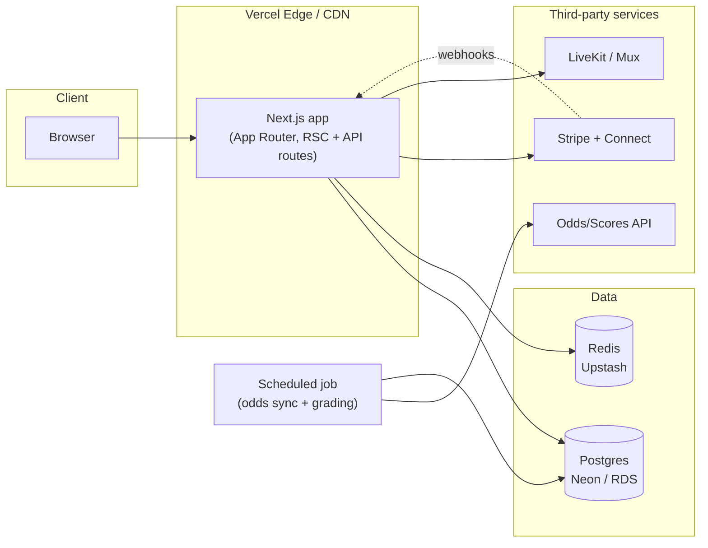

# OwnerFlow Sports — Architecture & Production Roadmap

This document describes what is built in this repository today: the data model,
the grading engine, the Stripe / odds-feed / LiveKit integrations, and what
remains to run it at scale past a single SQLite file.

## 1. What's implemented right now

A fully working Next.js 16 (App Router) application with a real relational
database, real authentication, and real server-side business logic — no mocked
UI states, no placeholder buttons. Specifically:

- **Auth**: NextAuth v5, credentials provider, bcrypt password hashing, JWT
  sessions, role-based access (`BETTOR`, `HANDICAPPER`, `ADMIN`).
- **Data model**: Prisma schema (`prisma/schema.prisma`) covering users,
  handicapper profiles, membership tiers, subscriptions, games, picks, parlays
  (with legs), purchases, follows, live feed posts/likes/comments, live
  streams/chat, and a wallet ledger. SQLite in dev, swaps to Postgres by
  changing one datasource line (see §3).
- **Grading engine** (`src/lib/grading.ts`): settles picks and parlays against
  final scores and derives every handicapper's public record from that graded
  history. Exposed as `POST /api/admin/grade` for an admin or a cron job.
- **Research board** (`/scores`): every game with its spread/total/moneyline,
  live scores, and the number of handicapper picks riding on it.
- **Marketplace economics**: every pick/parlay purchase and every subscription
  runs through a real `$transaction` — debits the buyer's wallet, credits the
  handicapper's earnings (80/20 split), and writes an auditable
  `WalletTransaction` row. With Stripe configured, wallets are funded by card
  and subscriptions bill through Stripe Connect (§4.1).
- **Handicapper Studio** (`/studio`): create picks, build multi-leg parlays,
  create membership tiers, schedule and go live on streams — all real writes
  against the database, gated to the authenticated handicapper's own profile.
- **Live feed**: real posts, likes, and comments (`/feed`), polling-based.
- **Live streaming**: real DB-backed live/scheduled/ended state and a
  polling-based live chat. With LiveKit configured the broadcaster publishes
  camera and mic to signed-in viewers (§4.3); without it they get a local
  camera preview.
- **Integrations**: Stripe (payments, subscriptions, Connect payouts), The Odds
  API (live games, lines, scores), and LiveKit (video) are all implemented and
  activated by environment variables — see §4. Each degrades gracefully, so
  with no credentials the app still runs end to end on a demo wallet, seeded
  games, and a local preview.

## 2. Tech stack

| Layer | Choice | Why |
|---|---|---|
| Framework | Next.js 16 (App Router, Turbopack, React 19) | Server components keep data-fetching close to the DB; API routes double as the backend. |
| Styling | Tailwind CSS v4 + hand-rolled Radix primitives | Full control over the luxury visual language without shipping a generic component-library look. |
| ORM | Prisma 6 | Type-safe schema, migrations, works identically against SQLite (dev) and Postgres (prod). |
| Auth | NextAuth v5 (Credentials + JWT) | Drop-in room to add OAuth providers later without touching the data model. |
| Validation | Zod | Every API route validates its body before touching the DB. |

## 3. Moving from SQLite to Postgres

1. Provision a Postgres instance (Neon, RDS, Supabase, or Vercel Postgres).
2. In `prisma/schema.prisma`, change:
   ```prisma
   datasource db {
     provider = "postgresql"
     url      = env("DATABASE_URL")
   }
   ```
3. Set `DATABASE_URL` to the Postgres connection string.
4. `npx prisma migrate deploy` to apply the existing migration history.
5. Two SQLite-specific things to double check after the switch: `String`
   columns used for pipe/comma-separated lists (`HandicapperProfile.specialties`,
   `MembershipTier.perks`) should become Postgres native arrays
   (`String[]`) — trivial migration, cosmetic only, everything still works if
   left as-is. Case-insensitive search in `/search` currently relies on
   SQLite's default case-insensitive `LIKE`; on Postgres add
   `mode: "insensitive"` to the `contains` filters in
   `src/app/search/page.tsx`.
6. Add PgBouncer (or your host's pooler) in front of Postgres once you're
   running serverless functions — Prisma's connection count adds up fast
   under concurrent invocations.

## 4. Third-party integrations

Stripe, The Odds API, and LiveKit are **implemented**. Each is activated by
environment variables and degrades gracefully when they're absent — with no
credentials the app runs on its demo wallet, seeded games, and a local camera
preview, so the repository is still fully runnable by anyone. `npm run
check:integrations` validates whatever is configured against the live provider.

### 4.1 Payments — Stripe (implemented)

Enabled by `STRIPE_SECRET_KEY` + `STRIPE_WEBHOOK_SECRET`.

**Money in.** `POST /api/stripe/wallet-checkout` opens a Checkout Session to
fund a member's wallet, and `POST /api/stripe/subscribe` opens a
`mode: "subscription"` session for a membership tier. Stripe Products/Prices
are created lazily per tier and cached on `MembershipTier.stripePriceId`.

**Money out.** Handicappers onboard through Stripe Connect (Express) at
`/studio/payouts`. A subscription to an onboarded handicapper is billed on
their account via `transfer_data.destination` with
`application_fee_percent = PLATFORM_FEE_PERCENT`, so their share settles
automatically. Pick sales run through the wallet ledger and are withdrawn on
demand by `POST /api/stripe/payout`, which reserves the balance in a
transaction *before* calling Stripe and passes an idempotency key, so a
double-click can't pay the same balance twice; a failed transfer returns the
reservation.

**Trust boundary.** `POST /api/stripe/webhook` is the only thing that grants
paid access. It verifies the signature against the raw request body and
records every `event.id` in `ProcessedWebhookEvent` before acting, so Stripe's
at-least-once delivery can't double-credit a wallet. If a handler throws, the
dedupe row is released so Stripe's retry can succeed. The browser redirect
after Checkout is never trusted — a user can navigate to the success URL
without paying.

PCI scope stays minimal: Checkout means card data never touches this server.

### 4.2 Live odds & scores — The Odds API (implemented)

Enabled by `ODDS_API_KEY`, scoped by `ODDS_API_SPORTS`.

`src/lib/odds.ts` pulls `/v4/sports/{key}/odds` for the board (spreads,
totals, moneylines) and `/v4/sports/{key}/scores` for live and final scores,
mapping our `Sport` enum onto the provider's sport keys. Rows are upserted on
`Game.externalId` — the provider's stable event id — so repeated syncs update
rather than duplicate, and a finished game is never regressed to scheduled by
an odds refresh.

`POST /api/admin/sync-odds` runs the whole cycle: refresh odds, refresh
scores, then grade. One sport failing (an out-of-season key, a quota trip)
is collected into the response's `errors` rather than aborting the rest.
Schedule it every few minutes on game days.

Grading needs no provider-specific code: `src/lib/grading.ts` parses each
pick's `selection` against the final score, settles it `WON`/`LOST`/`PUSH`,
computes unit P/L at American odds, and rebuilds the handicapper's record from
the settled history. Because `Pick.gameId` and `ParlayLeg.gameId` are foreign
keys to `Game`, flipping a game to `FINAL` with scores is all that's required
to trigger it. `POST /api/admin/grade` runs grading alone if you'd rather
schedule the two separately; both accept the `GRADING_CRON_SECRET` header or
an `ADMIN` session and are idempotent.

**On record integrity:** no code path anywhere writes a handicapper's
win/loss/units/ROI by hand. `recomputeHandicapperRecord()` is the sole writer,
and it derives every figure from graded wagers. Even the seed data works this
way: it generates real picks against real final scores and then runs the
grading engine, so the numbers on a profile are reproducible from the pick
table rather than invented. Prop bets carry no machine-readable line, so
`gradePick` returns `null` for them and leaves them pending for manual
settlement — that's the one queue you'd want an admin UI for.

### 4.3 Live video streaming — LiveKit (implemented)

Enabled by `LIVEKIT_API_KEY`, `LIVEKIT_API_SECRET`, `NEXT_PUBLIC_LIVEKIT_URL`.

`POST /api/streams/[id]/token` mints a room token scoped to
`ownerflow-stream-{id}`. **Publishing rights are granted only to the
handicapper who owns the stream**; everyone else joins subscribe-only, so a
viewer cannot push their own camera into someone's broadcast. Viewers must be
signed in to be issued a token at all.

`src/components/live/livekit-stage.tsx` renders the room for both sides;
`broadcast-controls.tsx` swaps its local `getUserMedia` preview for a
publishing room once the stream goes live. Chat continues to run through the
`StreamMessage` table, which stays the durable record regardless of transport.

### 4.4 Search & recommendations at scale

`/search` runs `LIKE` queries directly against Postgres — fine up to tens of
thousands of rows. Past that, add a search index (Postgres full-text search
via `tsvector` is the low-effort first step; Algolia/Meilisearch/Typesense if
you want typo-tolerance and faceting).

## 5. Deployment topology



- **Hosting**: Vercel is the path of least resistance for Next.js (this repo
  needs zero config changes to deploy there). A container-based host
  (Fly.io, Render, ECS) works equally well if you need the LiveKit media
  server co-located.
- **Redis**: not required today, but becomes worth adding for (a) rate
  limiting auth/purchase endpoints, (b) caching the handicapper leaderboard
  and feed queries, (c) backing a real-time pub/sub layer if you replace feed
  polling with WebSockets.
- **Background jobs**: the odds-sync + grading job in §4.2 and any Stripe
  reconciliation job should run outside the request/response cycle — Vercel
  Cron Jobs or a small worker process (BullMQ + Redis) both fit.
- **Object storage**: handicapper avatars, hero images, and feed post images
  aren't in the current build (deliberately — see design notes below). Add
  S3/R2 + `next/image` remote patterns when real image upload lands.

## 6. Security checklist for launch

- [ ] Move `AUTH_SECRET` generation out of `.env` committed-by-convention and
      into your host's secret manager; rotate it before go-live.
- [ ] Rate-limit `/api/register`, `/api/auth/*`, `/api/purchases`, and
      `/api/subscriptions` (Redis token bucket, or Vercel's built-in
      protections) to blunt credential-stuffing and purchase-spam abuse.
- [ ] Add server-side re-validation of every price at purchase time (already
      done — `priceCents` is read from the DB row inside the transaction, never
      trusted from the client) — keep this invariant as new purchasable
      content types are added.
- [ ] Add audit logging on `HandicapperProfile.earningsCents` mutations before
      wiring real Stripe transfers to them.
- [ ] Content moderation pass on `FeedPost`/`FeedComment`/`StreamMessage`
      free-text fields before opening signups publicly (basic profanity/abuse
      filtering, report/flag flow, admin moderation queue — `Role.ADMIN`
      exists in the schema for this).
- [ ] Responsible-gambling and age-gating language is already present
      (`/responsible-play`, footer disclaimer) — confirm it satisfies the
      regulations of every state/country you launch in; sports-adjacent
      platforms often have jurisdiction-specific licensing requirements even
      when, like this one, they never accept a wager.

## 7. Design notes (why some things are deliberately not done)

- **No stock/AI-generated photography.** Handicapper avatars are gold-on-charcoal
  monogram tiles, not photos, so the product doesn't lean on generic headshot
  imagery. Swap in real photo upload (S3 + `next/image`) once handicappers are
  onboarding for real — the `Avatar`/`AvatarFallback` components already
  support an `avatarUrl` field on `User`, it's just unset in seed data.
- **No fake video calls.** Rather than build a stream viewer that looks like
  it's showing live video while actually showing nothing, the viewer
  experience is honestly framed as a live analysis room (real chat, real
  live/viewer-count state) until real media infrastructure (§4.3) is wired
  in. A convincing fake is worse than an honest placeholder.
- **Demo wallet, not fake Stripe.** Every purchase/subscribe button is fully
  functional end-to-end against the real data model; the only thing that's
  simulated is where the dollars originate. This means the entire commerce
  flow (pricing, gating, revenue split, ledger) is already correct and tested
  — §4.1 is a swap, not a rewrite.
